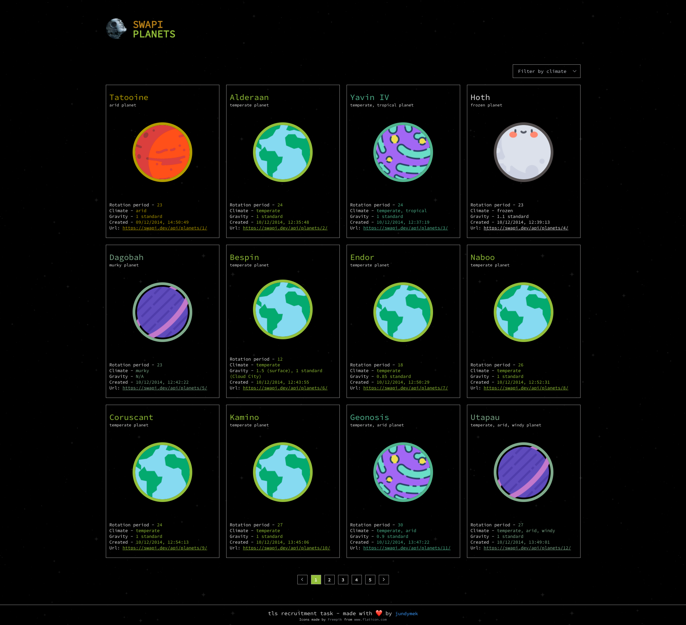
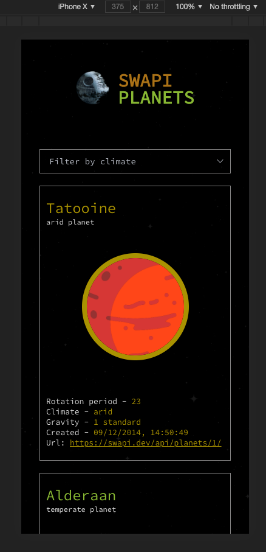
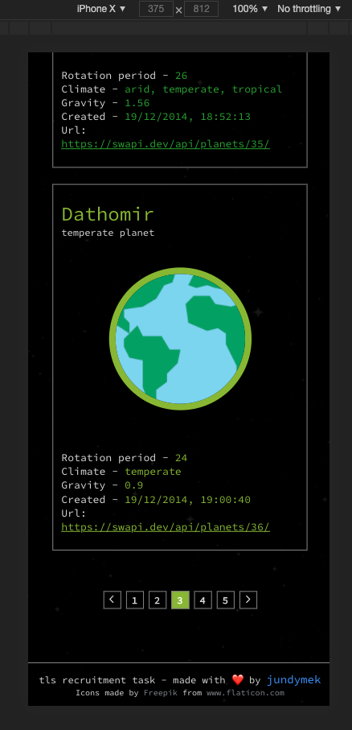
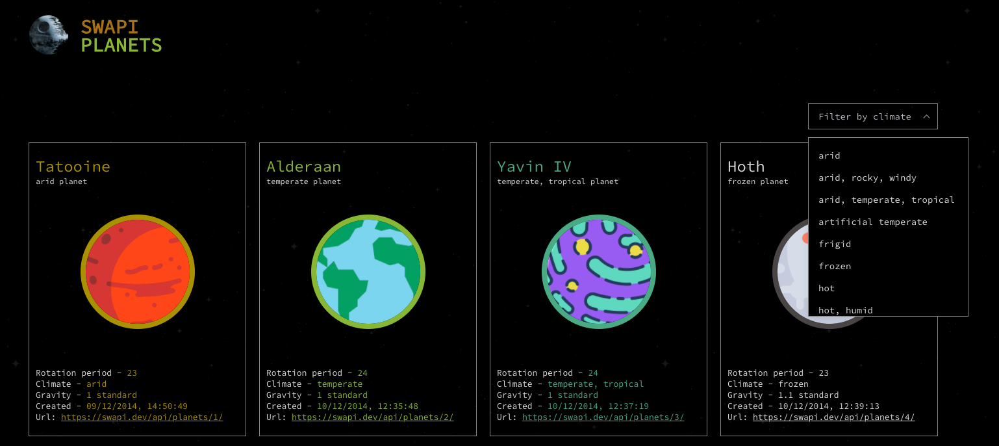

# recruitment-task

Po sklonowaniu repozytorium, zainstaluj wszystkie pakiety z pliku **package.json**. Użyj do tego komendy: 

```yarn install ```
## Lista planet - vue.js


Zadanie polega na utworzeniu strony wyświetlającej listę planet. 

Lista powinna zostać pobrana z zewnętrznego API znajdującego się pod tym adresem: https://swapi.dev/api/planets.

Do pobrania danych z API wykorzystaj **AJAX**.

Zapytania z API idą czasem bardzo długo, więc należałoby dodać loading. 

Każdy element listy powinien być ostylowany oraz powinien zawierać następujące parametry:
* name
* rotation_period
* climate
* gravity
* created
* url

Dodatkowym plusem będzie stworzenie paginacji oraz filtrowania aktualnej strony po którymś z parametrów.

Możesz wykorzystać bibliotekę komponentów **Element UI**. 

Finalny projekt zapisz jako repozytorium w w githubie i udostępnij nam link.

W zadaniu staraj się zwracać uwagę na dobre praktyki oraz na to żeby aplikacja była responsywna.

Jeśli nie uda Ci się zrobić zadania na czas lub będziesz miał problem z komunikacją z API, możesz skupić się tylko na ostylowaniu listy dla jakichś statycznych danych oraz na responsywności.

---

### Screenshots





### Wykorzystane technologie 🚀

- [Vue.js](https://vuejs.org/)
- [Element UI](https://element.eleme.io/#/en-US)
- SCSS
- Flexbox
- [The Star Wars API API](https://swapi.dev/) - API

### Linki

- Kod: [https://github.com/jundymek/tls-planets-vue](https://github.com/jundymek/tls-planets-vue)
- Wersja live: [https://jundymek.github.io/tls-planets-vue/](https://jundymek.github.io/tls-planets-vue/)

### Trochę o zadaniu

Zadanie raczej nie należało do najtrudniejszych, ale jak to zwykle bywa parę rzeczy wymagało chwili zastanowienia i "przewertowania" stron dokumentacji. Starałem się nie mieszać w szkielecie otrzymanym w zadaniu i wykorzystałem vue2 (options API) zamiast preferowanego Vue3 i composition API (w połączeniu z typescriptem). Użyłem wskazanej biblioteki **Element UI** do szybszego ostylowania niektórych elementów. Nie jestem zwolennikiem takich gotowców, ale w zasadzie wydaje mi się, że w dłuższej perspektywie może to faktycznie ułatwić pracę. Muszę na pewno popracować nad testami, który to temat tylko pobieżnie poruszyłem w tym projekcie. Starałem się podzielić kod na wzór zaproponowanego szkieletu, choć na tą chwilę osobiście wolę komponenty zintegrowane w całość (templatka, skrypty i style razem - w jednym miejscu). Uważam, że do wydzielania logiki idealnie nadeje sie Composition API i composables. 

Jeśli chodzi o samo pobranie danych z API to początkowo zrobiłem to w sposób, na który wsakzuje samo API czyli na każdej podstronie pobierałem po 10 planet (dane pobierały się co 10 elementów), ale potem doszedłem do wniosku, że nie jest to najlepsze rozwiażanie z uwagi na ograniczenia w filtrowaniu (zawężone do jednej podstrony) i doczytywanie danych przy przechodzeniu na kolejne podstrony. Teraz na początku pobierają sie rekurencyjnie wszystkie planety, dzięki czemu po wczytaniu strony (odrobinę dłuższym) dostępne są już wszystkie planety. Przechodzenie pomiędzy podstronami nie wymaga kolejnych zapytań do API i dane można filtrować z całości bazy.

### Trochę o autorze

- Website - [https://jundymek.com](https://jundymek.com)
- Github - [https://github.com/jundymek](https://github.com/jundymek)
